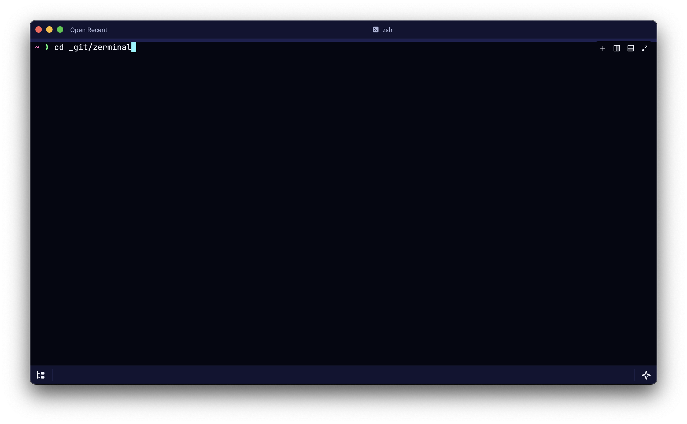
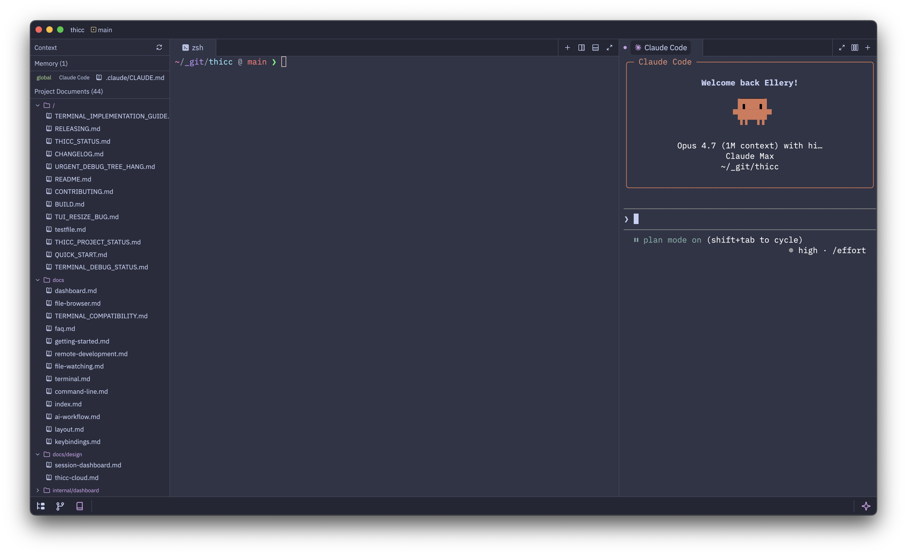
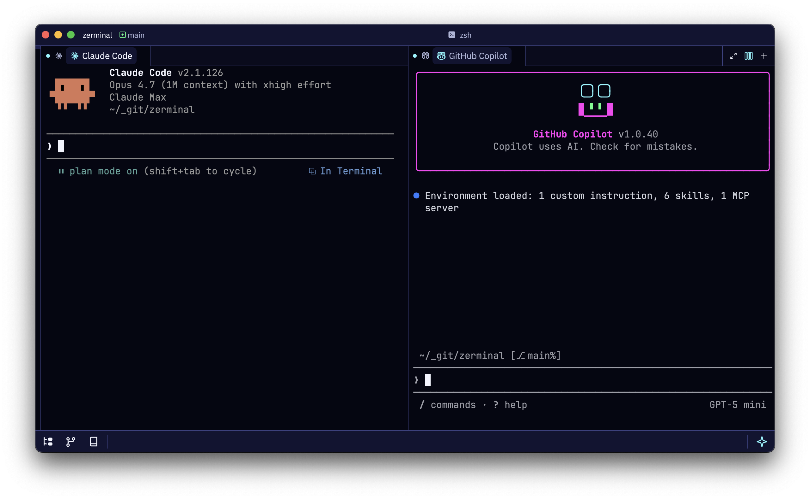

# Zerminal

A terminal-first development environment for agentic coding, forked from [Zed](https://github.com/zed-industries/zed).



## What is Zerminal?

Zerminal puts the terminal at the center of the IDE experience. The terminal is the primary workspace; the editor is secondary, used to review and steer rather than to write. Projects are auto-detected from the active terminal's working directory — panels, git status, and AI agents all follow along.

It's designed for one specific workflow: using CLI coding agents. Zed's built-in AI agent is removed; instead, Zerminal auto-detects whichever agent CLIs you have installed (Claude Code, Codex, Aider, and similar) and lets you launch them into a dedicated pane. You can run several side by side when one isn't enough — three agents working in parallel on different tasks is a first-class layout, not a workaround.

Supporting panels — a file browser, a git panel, and a context pane for surfacing files like `CLAUDE.md` or project notes to whichever agent you're working with — are there when you want them and hidden when you don't. The goal is minimal chrome around a lot of terminal.


*Agents live in a dedicated pane. The context pane slides in from the side when you want to feed `CLAUDE.md` or project notes to the agent.*


*Run multiple agents concurrently — Claude Code, Codex, GitHub Copilot, Aider, or similar CLIs — on different tasks in the same workspace.*

## Status

Zerminal is a personal project, currently at v0.1.x. It's developed and tested on macOS (Apple Silicon) and Fedora Linux. There is no release cadence and no support SLA. It's shared openly in case it's useful to anyone with the same itch; if something breaks for you, an issue is welcome but may take time.

## Install

Pre-built binaries for each release live on the [releases page](https://github.com/elleryfamilia/zerminal/releases/latest).

### macOS (Apple Silicon)

```bash
brew install --cask elleryfamilia/zerminal/zerminal
```

Signed and notarized — Gatekeeper accepts it on first launch. Intel Macs are not built; [build from source](#build-from-source) instead.

<details>
<summary>Manual DMG download</summary>

```bash
curl -L -o Zerminal.dmg https://github.com/elleryfamilia/zerminal/releases/latest/download/Zerminal-aarch64.dmg
open Zerminal.dmg
```

</details>

### Linux (x86_64)

```bash
curl -fsSL https://github.com/elleryfamilia/zerminal/releases/latest/download/install.sh | sh
```

Installs into `~/.local/zerminal.app` and symlinks the launcher to `~/.local/bin/zerminal` — no sudo, same path on every distro. Zerminal's built-in updater applies new releases in place, the same way it does on macOS.

<details>
<summary>Audit before running, or install manually</summary>

Audit the script first:

```bash
curl -fsSLO https://github.com/elleryfamilia/zerminal/releases/latest/download/install.sh
less install.sh
sh install.sh
```

Manual install (equivalent to what the script does):

```bash
curl -L -o /tmp/zerminal.tar.gz https://github.com/elleryfamilia/zerminal/releases/latest/download/zerminal-linux-x86_64.tar.gz
mkdir -p ~/.local/bin
tar -xzf /tmp/zerminal.tar.gz -C ~/.local
ln -sfn ~/.local/zerminal.app/bin/zerminal ~/.local/bin/zerminal
# ensure ~/.local/bin is on PATH (add to your shell's rc file once):
#   export PATH="$HOME/.local/bin:$PATH"
```

</details>

## Build from source

```bash
cargo run -p zerminal
```

On Linux, install system dependencies first — see [Building for Linux](./docs/src/development/linux.md).

On macOS, Zed's upstream build prerequisites apply; see [Zed's macOS build guide](https://github.com/zed-industries/zed/blob/main/docs/src/development/macos.md).

## How it differs from Zed

- **Bring-your-own agent, auto-detected.** Zed's agent panel, billing, and account system are gone. Zerminal detects the CLI agents installed on your system (Claude Code, Codex, Aider, etc.) and lets you launch them directly — no account, no subscription, no lock-in to a specific provider.
- **Multiple agents, side by side.** Run several agent terminals concurrently in a split layout when you want them working on different tasks in parallel.
- **Context pane.** A dedicated panel for surfacing `CLAUDE.md`, `AGENTS.md`, and other project-level context files alongside whichever agent you're steering.
- **Terminal-first workspace.** Opens into a terminal rather than an editor welcome screen. The active terminal's working directory drives project detection, not a file you happened to open.
- **Less chrome.** No breadcrumbs, no collaboration UI, no extensions marketplace, simplified split behavior, fewer panel toggles.

See [`docs/docs/01-vision.md`](./docs/docs/01-vision.md) for the full rationale.

## Non-goals

- A built-in AI chat or agent. Users bring their own CLI agent.
- A plugin or extension marketplace. Zerminal is a fork, not a platform.
- Collaboration or multiplayer features.

## Relationship to Zed

Zerminal exists because Zed's direction — a batteries-included editor with an integrated agent, collaboration, and an extension ecosystem — points away from the terminal-first tool I wanted to use. That's a reasonable direction for Zed; it just isn't this one. Zerminal keeps Zed's excellent foundation (GPUI, the terminal, the editor core, tree-sitter, LSP) and strips or replaces the rest.

Upstream changes from [`zed-industries/zed`](https://github.com/zed-industries/zed) are cherry-picked selectively, not merged wholesale. The rebrand is deliberate: Zerminal installs as its own application alongside Zed, not as a replacement.

## Contributing

Issues and small pull requests are welcome, but this is a personal project with an opinionated scope. Before opening a substantial PR, please read [`docs/docs/01-vision.md`](./docs/docs/01-vision.md) — changes that move the project toward a general-purpose IDE or replicate non-goals are unlikely to be merged.

## License

Zerminal inherits Zed's licensing:

- Zerminal and Zed editor code: [GPL-3.0-or-later](./LICENSE-GPL)
- GPUI framework: [Apache-2.0](./LICENSE-APACHE)
- Pre-rebrand Zed history: [AGPL-3.0](./LICENSE-AGPL)

See the individual `LICENSE-*` files for full terms. Third-party dependency licenses are managed via `cargo-about`.
